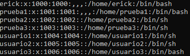
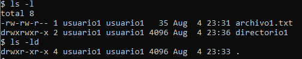

# Parte 1: Gestión de Usuarios

## 1. Creación de usuarios
### Comandos:
```bash
sudo useradd usuario1
sudo useradd usuario2
sudo useradd -m -s /bin/bash usuario3
```
Se puede utilizar también el comando adduser que realiza automáticamente otras funciones con interfaz en la consola, como agregar contraseña y otros datos de información.

Para este caso se utiliza un comando más básico para hacer las siguientes instrucciones paso por paso (como agregar contraseña en el paso 2).

### Flags en el comando:
Se pueden adicionar flags al comando **useradd** para realizar funciones extras.

>-m : crea directorio home para el usuario

>-s : establece el shell con el que inicia sesión el usuario


## 2. Asignación de contraseñas:
### Comandos:
```bash
sudo passwd usuario1
sudo passwd usuario2
sudo passwd usuario3
```
Escribir la contraseña dos veces para cada usuario (nueva contraseña y la confirmación de la contraseña).


## 3. Información de usuarios:
### Comandos:
```bash
id usuario1
```

### Resultado:
> uid=1004(usuario1) gid=1004(usuario1) groups=1004(usuario1)

En este caso el uid no es el 1001 porque se habían realizado pruebas anteriormente.



## 4. Eliminación de usuarios:
### Comandos:
```bash
sudo userdel usuario3
```
Para evitar eliminar su directorio, se omite el flag ``-r``.

# Parte 2: Gestión de Grupos
## 1. Creación de grupos:
### Comandos:
```bash
sudo groupadd grupo1
sudo groupadd grupo2
```


## 2. Agregar usuarios a grupos:
### Comandos:
```bash
sudo usermod -aG grupo1 usuario1
sudo usermod -aG grupo2 usuario2
```

### Flags en el comando:
> -aG : addGroup, es la parte que agrega a un grupo, el usuario indicado al final del comando

## 3. Verificar membresía:
### Comandos:
```bash
groups usuario1 usuario2
```

### Resultado:
> usuario1 : usuario1 grupo1 \
> usuario2 : usuario2 grupo2

## 4. Eliminar grupo:
### Comandos:
```bash
sudo groupdel grupo2
```

# Parte 3: Gestión de Permisos:
## 1. Creación de archivos y directorios:
### Comandos:
```bash
# crear directorio principal en caso no exista
sudo mkdir /home/usuario1
sudo chown usuario1:usuario1 /home/usuario1

# cambiar al usuario
sudo su - usuario1

# crear archivo y escribir en él
nano archivo1.txt

# crear carpeta y archivo dentro de la carpeta
mkdir directorio1
touch directorio1/archivo2.txt
```

## 2. Verificar permisos:
### Comandos:
```bash
ls -l
ls -ld
```

### Resultado:


## 3. Modificar permisos con modo numérico:
### Comandos:
```bash
chmod 640 archivo1.txt
```

## 4. Modificar permisos con modo simbólico:
### Comandos:
```bash
chmod u+x directorio1/archivo2.txt
```

## 5. Cambiar el grupo propietario:
### Comandos:
```bash
chgrp grupo1 directorio1/archivo2.txt
```

## 6. Configurar permisos de directorio:
### Comandos:
```bash
chmod 750 directorio1/
```

## 7. Comprobación de acceso:
### Comandos:
```bash
#salir del usuario1
exit

#acceder como usuario2
sudo su - usuario2

#leer archivo 1 y archivo 2
cd usuario1/
cat archivo1.txt
cat directorio1/archivo2.txt
```

### Resultado:
> cat: archivo1.txt: Permission denied \
> cat: directorio1/archivo2.txt: Permission denied

## 8. Verificación final:
### Comandos:
```bash
#salir del usuario2 y regresar al usuario1 (tambien se puede verificar con superuser)
exit
sudo su - usuario1

#navegar al directorio principal de usuario1
cd home/usuario1/
#ver permisos de archivo1 y directorio1
ls -l
ls -ld

#ver permisos de archivo2
cd directorio1/
ls -l
ls -ld
```

### Resultado:
archivo 1 y directorio1
> \$ ls -l \
total 8\
-rw-r----- 1 usuario1 usuario1   35 Aug  4 23:31 archivo1.txt \
drwxr-x--- 2 usuario1 usuario1 4096 Aug  4 23:36 directorio1 \
$ ls -ld \
drwxr-xr-x 4 usuario1 usuario1 4096 Aug  4 23:33 .

archivo 2
> \$ ls -l \
total 0 \
-rwxrw-r-- 1 usuario1 grupo1 0 Aug  4 23:36 archivo2.txt

# Reflexión
¿Por qué es importante gestionar correctamente los usuarios y permisos en un sistema operativo?

*Para llevar un mejor control sobre archivos importantes que sólo debería de ver el propietario o cierto grupo en específico.*

*También para agregar una capa de seguridad extra y evitar que se ejecute algún programa sin autorización o algún usuario modifique o elimine archivos de manera intencional o accidental.*